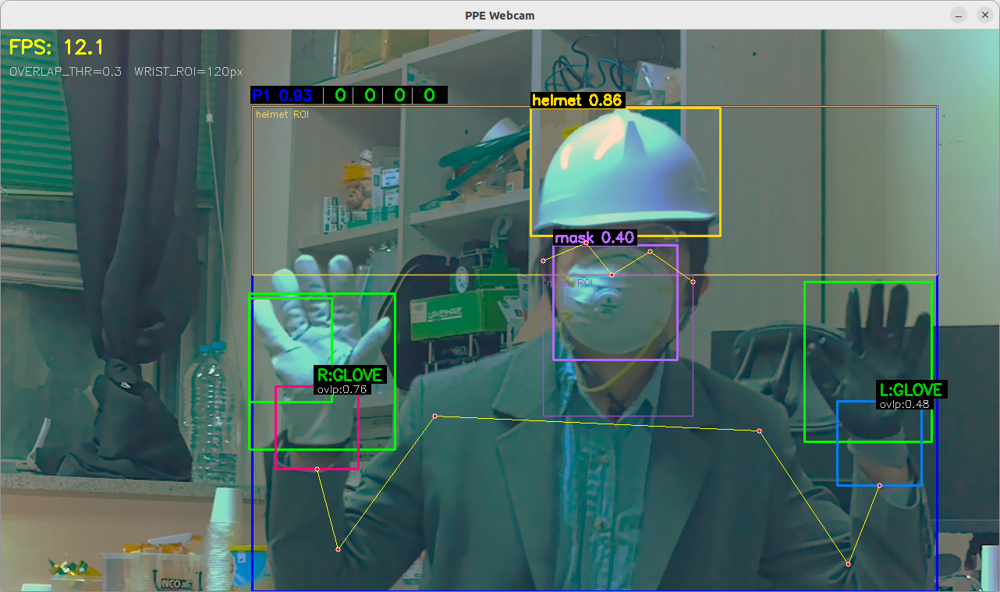

# PPE Detection on Jetson Orin Nano

실시간 웹캠 영상에서 안전 장비(헬멧, 마스크, 장갑) 미착용을 감지하고,
**위반 사건을 자동으로 단속 DB에 적재**하는 시스템입니다.
YOLO-World + YOLO Pose 모델 기반으로 NVIDIA Jetson Orin Nano Super에서 동작합니다.

## 주요 기능

- **실시간 PPE 탐지**: YOLO-World로 헬멧/마스크/장갑 인식 (TensorRT 가속)
- **person 단위 추적**: ByteTrack(supervision)으로 사람별 ID 부여
- **위반 자동 적재**: 미착용이 10초 이상 지속되면 person bbox 크롭 + JPEG로 MariaDB에 BLOB 저장
- **실시간 스트리밍**: MJPEG 5001 포트로 다중 카메라 동시 송출
- **다중 카메라 지원**: USB / CSI / Intel RealSense 자동 탐지

---

## 실험 환경 (Hardware Spec)

| 항목 | 사양 |
|------|------|
| 보드 | NVIDIA Jetson Orin Nano Engineering Reference Developer Kit Super |
| CPU | Cortex-A78AE (6-core) |
| RAM | 8GB (CPU/GPU 공유) |
| 저장공간 | 128GB microSD |
| OS | Ubuntu 22.04 (JetPack R36.4.7) |
| CUDA | 12.6 |
| TensorRT | 10.3.0 |
| 카메라 | ArduCAM IMX477 (CSI) + USB 웹캠 + Intel RealSense |
| DB | AWS Lightsail MariaDB 10.11 |

---

## 파일 구조

```
ppe_detector_capstone_2601/
├── models/                          # 모델 가중치 (별도 준비 필요)
│   ├── yolov8s-worldv2.pt / .engine # YOLO-World (헬멧/마스크/장갑/사람)
│   └── yolo11n-pose.pt / .engine    # YOLO Pose (손목 위치)
├── ppe_detection.py                 # PPE 탐지 (.pt 버전)
├── ppe_detection_with_trt.py        # PPE 탐지 + 위반 적재 (TensorRT, 권장)
├── export_trt.py                    # .pt → .engine 변환
├── db_config.py                     # DB 접속 설정 (.env 로드)
├── area_loader.py                   # areas 테이블 → camera_key 매핑 로드
├── violation_tracker.py             # 위반 상태 추적 (10초 지속 + 5분 cooldown)
├── image_utils.py                   # person bbox 크롭 + JPEG 인코딩
├── violation_logger.py              # 비동기 BLOB INSERT 워커
├── extract_image.py                 # DB BLOB → 파일 추출 (검증용)
├── .env                             # DB 비밀번호 (gitignore)
└── requirements.txt
```

---

## 위반 적재 시스템

### 알고리즘

`(카메라, person_id, PPE type)` 단위로 미착용 상태를 추적하여, 일정 시간 지속되면 위반으로 판정합니다.

| 설정 | 값 | 의미 |
|------|-----|------|
| `SUSTAIN_SECONDS` | 10초 | 미착용이 이 시간 이상 지속되면 위반 발생 |
| `COOLDOWN_SECONDS` | 5분 | 같은 (카메라, ID, type)은 이 시간 동안 재기록 안 함 |

PPE type 4종을 **독립적으로** 추적합니다: `no_helmet`, `no_mask`, `no_glove_left`, `no_glove_right`.

### 증거 이미지 처리

- 원본 frame에서 person bbox 크롭 (10% padding)
- 긴 변 480px로 리사이즈
- JPEG quality 85로 압축 (보통 5~30KB)
- MariaDB `violations.image_data` (MEDIUMBLOB)에 비동기 INSERT

### DB 스키마 (`capstone_db.violations`)

| 컬럼 | 타입 | 설명 |
|------|------|------|
| id | INT AUTO_INCREMENT | PK |
| violation_type | VARCHAR(50) | no_helmet / no_mask / no_glove_left / no_glove_right |
| detected_at | DATETIME | 위반 발생 시각 |
| area_id | INT | areas FK (camera_key 기반 매핑) |
| person_id | INT | ByteTrack 부여 ID |
| image_data | MEDIUMBLOB | 크롭된 person JPEG |
| image_mime | VARCHAR(20) | 'image/jpeg' |
| is_checked | TINYINT(1) | 처리 여부 (0=미처리, 1=처리됨) |

`camera_key` ↔ `area_id` 매핑은 `areas` 테이블에서 시작 시 자동 로드됩니다.

---

## 설치 과정

### 1. JetPack 버전 확인

```bash
sudo apt show nvidia-jetpack -a
cat /etc/nv_tegra_release
```

### 2. 시스템 패키지 설치

```bash
sudo apt-get -y update
sudo apt-get install -y python3-pip libopenblas-dev nano autossh putty-tools v4l-utils
```

### 3. cusparseLt 설치 (CUDA 12.6용)

```bash
wget https://developer.download.nvidia.com/compute/cusparselt/redist/libcusparse_lt/linux-aarch64/libcusparse_lt-linux-aarch64-0.6.2.3-archive.tar.xz
tar xf libcusparse_lt-linux-aarch64-0.6.2.3-archive.tar.xz
sudo cp libcusparse_lt-linux-aarch64-0.6.2.3-archive/include/* /usr/local/cuda/include/
sudo cp libcusparse_lt-linux-aarch64-0.6.2.3-archive/lib/* /usr/local/cuda/lib64/
sudo ldconfig
```

### 4. uv 설치

```bash
curl -LsSf https://astral.sh/uv/install.sh | sh
source ~/.bashrc
uv --version
```

### 5. 가상환경 생성

```bash
cd ~/Documents/ppe_detector_capstone_2601
uv venv PPEDetector --python 3.10
source PPEDetector/bin/activate
```

### 6. Jetson용 PyTorch 설치

```bash
wget https://developer.download.nvidia.com/compute/redist/jp/v61/pytorch/torch-2.5.0a0+872d972e41.nv24.08.17622132-cp310-cp310-linux_aarch64.whl
mv torch-2.5.0a0+872d972e41.nv24.08.17622132-cp310-cp310-linux_aarch64.whl torch-2.5.0a0-cp310-cp310-linux_aarch64.whl
```

> ⚠️ **주의:** `$(which python3)` 는 시스템 Python(`/usr/bin/python3`)을 가리켜 권한 오류가 발생합니다.
> 반드시 가상환경 Python 경로를 **직접** 지정해야 합니다.

```bash
UV_SKIP_WHEEL_FILENAME_CHECK=1 uv pip install \
  --python ~/Documents/ppe_detector_capstone_2601/PPEDetector/bin/python3 \
  torch-2.5.0a0-cp310-cp310-linux_aarch64.whl
```

#### python3 명령어 alias 등록

설치 후에도 `python3` 명령이 시스템 Python을 가리켜 `import torch`가 실패합니다.
`which python3`는 alias를 무시하므로 `type python3`로 확인해야 합니다.

```bash
echo 'alias python3="~/Documents/ppe_detector_capstone_2601/PPEDetector/bin/python3"' >> ~/.bashrc
source ~/.bashrc

# alias 적용 확인 (which 가 아닌 type 으로 확인)
type python3
# 출력: python3은(는) '..../PPEDetector/bin/python3'의 별칭임
```

CUDA 연동 확인:
```bash
python3 -c "import torch; print(torch.__version__); print(torch.cuda.is_available())"
# 출력: 2.5.0a0+872d972e41.nv24.08 / True
```

### 7. torchvision 소스 빌드

```bash
# 빌드 의존성 설치
sudo apt install -y libjpeg-dev zlib1g-dev libpython3-dev libopenblas-dev libavcodec-dev libavformat-dev libswscale-dev

# 소스 다운로드
git clone --branch v0.20.0 https://github.com/pytorch/vision torchvision
cd torchvision

# 빌드 (약 30~60분 소요)
export PYTHONPATH=/usr/lib/python3/dist-packages:$PYTHONPATH
export BUILD_VERSION=0.20.0
export CUDA_HOME=/usr/local/cuda
export FORCE_CUDA=1
export TORCH_CUDA_ARCH_LIST="8.7"
python3 setup.py bdist_wheel

# 설치
uv pip install dist/torchvision-0.20.0-cp310-cp310-linux_aarch64.whl

cd ..
```

torchvision `_meta_registrations.py` 패치 (nms 오류 방지):
```bash
python3 -c "
import re
path = 'PPEDetector/lib/python3.10/site-packages/torchvision/_meta_registrations.py'
with open(path, 'r') as f:
    content = f.read()
content = re.sub(r'@register_meta.*?def meta_nms.*?return torch\.empty.*?\n', '', content, flags=re.DOTALL)
with open(path, 'w') as f:
    f.write(content)
print('Done')
"
```

### 8. numpy 버전 고정

```bash
uv pip install "numpy<2"
```

### 9. TensorRT 파이썬 바인딩 연결

```bash
ln -s /usr/lib/python3.10/dist-packages/tensorrt \
  ~/Documents/ppe_detector_capstone_2601/PPEDetector/lib/python3.10/site-packages/tensorrt

python3 -c "import tensorrt as trt; print(trt.__version__)"
# 출력: 10.3.0
```

### 10. GStreamer 지원 OpenCV 연결

```bash
# 기존 OpenCV 제거
uv pip uninstall opencv-python opencv-contrib-python

# 시스템 OpenCV(GStreamer 포함) 설치
sudo apt install -y python3-opencv

# 심볼릭 링크 연결
rm ~/Documents/ppe_detector_capstone_2601/PPEDetector/lib/python3.10/site-packages/cv2
ln -s /usr/lib/python3.10/dist-packages/cv2 \
  ~/Documents/ppe_detector_capstone_2601/PPEDetector/lib/python3.10/site-packages/cv2

# GStreamer 지원 확인
python3 -c "import cv2; print(cv2.getBuildInformation())" | grep GStreamer
# 출력: GStreamer: YES
```

### 11. 일반 패키지 설치

```bash
# requirements.txt에서 충돌 패키지 제거 후 설치
sed 's/==.*//' requirements.txt | sed 's/@ .*//' > requirements_nover.txt
uv pip install -r requirements_nover.txt
```

### 12. DB / 트래커 관련 추가 패키지

```bash
uv pip install pymysql python-dotenv
uv pip install --no-deps supervision
uv pip install --no-deps defusedxml pydeprecate
```

> ⚠️ `supervision`은 `--no-deps`로 설치해야 numpy 2.x / opencv-python 충돌을 막을 수 있습니다.

### 13. `.env` 파일 작성

```bash
cat > .env << 'EOF'
DB_HOST=127.0.0.1
DB_PORT=3306
DB_USER=root
DB_PASSWORD=<MariaDB 비밀번호>
DB_NAME=capstone_db
EOF
chmod 600 .env
```

> ⚠️ `.env`는 **반드시** `.gitignore`에 포함시켜 깃허브에 노출되지 않게 합니다.

### 14. SSH 터널 (DB 접속용) systemd 서비스 등록

AWS MariaDB는 외부로 직접 노출하지 않고 SSH 터널을 통해 접속합니다 (`Jetson:3306` → `AWS:3308`).

```bash
sudo tee /etc/systemd/system/ppe-db-tunnel.service > /dev/null << 'EOF'
[Unit]
Description=PPE DB SSH Forward Tunnel to AWS MariaDB
After=network-online.target
Wants=network-online.target
Before=ppe-stream.service

[Service]
Type=simple
User=nana1124
Environment="AUTOSSH_GATETIME=0"
ExecStart=/usr/bin/autossh -M 0 -N \
    -o ServerAliveInterval=30 \
    -o ServerAliveCountMax=3 \
    -o ExitOnForwardFailure=yes \
    -o StrictHostKeyChecking=accept-new \
    -i /home/nana1124/Documents/ppe_detector_capstone_2601/.ssh/my_key.pem \
    -L 3306:localhost:3308 \
    ubuntu@<AWS_IP>
Restart=always
RestartSec=10

[Install]
WantedBy=multi-user.target
EOF

sudo systemctl daemon-reload
sudo systemctl enable ppe-db-tunnel
sudo systemctl start ppe-db-tunnel
sudo systemctl status ppe-db-tunnel
```

### 15. 최대 성능 모드 설정

```bash
sudo nvpmodel -m 0
sudo jetson_clocks
```

---

## 모델 파일 준비

### pt 파일 다운로드 (Windows/Linux PC에서)

```python
from ultralytics import YOLO
YOLO('yolov8s-worldv2.pt')   # 자동 다운로드
YOLO('yolo11n-pose.pt')       # 자동 다운로드
```

자동 다운로드 실패 시 아래 링크에서 수동 다운로드:
- [yolov8s-worldv2.pt](https://github.com/ultralytics/assets/releases/download/v8.4.0/yolov8s-worldv2.pt)
- [yolo11n-pose.pt](https://github.com/ultralytics/assets/releases/download/v8.4.0/yolo11n-pose.pt)

다운로드된 파일을 `models/` 폴더에 복사.

### TensorRT 엔진 변환 (Jetson에서 직접 실행)

```bash
source PPEDetector/bin/activate
python3 export_trt.py
# 약 10~20분 소요
# models/yolov8s-worldv2.engine, models/yolo11n-pose.engine 생성
```

---

## 실행

### 개발 모드 (수동 실행)

```bash
cd ~/Documents/ppe_detector_capstone_2601
source PPEDetector/bin/activate

# DB 터널 살아있는지 확인
ss -tnlp | grep 3306

# 추론 시작
python3 ppe_detection_with_trt.py
```

종료: `Ctrl+C`

### 운영 모드 (systemd 서비스)

부팅 시 자동 시작되도록 `ppe-stream.service`로 등록되어 있습니다.

```bash
sudo systemctl start ppe-stream         # 시작
sudo systemctl stop ppe-stream          # 중지
sudo systemctl status ppe-stream        # 상태
sudo journalctl -u ppe-stream -f        # 실시간 로그
```

### 카메라 자동 탐지

`ppe_detection_with_trt.py`는 실행 시 연결된 카메라를 자동 탐지합니다.
USB / CSI / Intel RealSense 모두 지원되며, 별도 설정 없이 카메라 수만큼 추론 슬롯이 활성화됩니다.

```
▶ 모델 로드 중...
✓ 모델 로드 완료
▶ areas 매핑 로드 중...
✓ 2개 카메라 매핑 로드:
  USB_2304_4922_PORT_1-2.1 → area_id=1
  USB_2304_4922_PORT_1-2.2 → area_id=5
▶ 카메라 탐지 중...
  → USB /dev/video0 시도 중... ✓ CAM0(USB0) 추가  [key=USB_2304_4922_PORT_1-2.2]
✓ ViolationLogger 워커 스레드 시작
✓ 위반 추적기/로거 준비 완료
✓ MJPEG 스트리밍 서버 시작 (포트 5001)
```

탐지 로직은 `v4l2-ctl --list-devices` 출력을 파싱해 USB 장치만 추려내며, tegra(CSI) 노드와 프레임이 없는 메타 노드는 자동으로 제외됩니다.

파일 상단에서 조정 가능한 주요 설정값:

| 설정값 | 설명 |
|--------|------|
| `CSI_SENSOR_ID` | CSI 카메라 sensor-id (기본값: 0) |
| `WB_MODE` | CSI 화이트밸런스 모드 (1=백열등, 4=형광등) |
| `CSI_B/G/R_GAIN` | CSI 화이트밸런스 보정 게인 |
| `USB_W`, `USB_H`, `USB_FPS` | USB 웹캠 해상도 및 프레임레이트 |
| `SUSTAIN_SECONDS` | 위반 판정 지속 시간 (`violation_tracker.py`) |
| `COOLDOWN_SECONDS` | 같은 위반 재기록 방지 시간 |
| `PADDING_RATIO` | 크롭 시 박스 주변 여유 (`image_utils.py`) |
| `MAX_LONG_SIDE` | 크롭 이미지 긴 변 최대 픽셀 |
| `JPEG_QUALITY` | JPEG 압축 품질 (1-100) |

---

## 화면 표시

PPE 상태는 person 박스 상단에 `ID7 0.93 | O | X | O | O` 형식으로 표시됩니다.

| 위치 | 의미 |
|------|------|
| `ID7` | ByteTrack이 부여한 person ID (`ID?`이면 트래커가 아직 ID 부여 전) |
| `0.93` | person 검출 confidence |
| 4개 박스 | 헬멧 \| 마스크 \| 왼손 장갑 \| 오른손 장갑 (O=착용, X=미착용) |

### 탐지 항목 색상

| 항목 | 색상 | 설명 |
|------|------|------|
| Person | 파란색 | 사람 바운딩 박스 |
| Helmet | 노란색 | 헬멧 감지 |
| Mask | 보라색 | 마스크 감지 |
| Glove | 초록색 | 장갑 바운딩 박스 |
| Wrist ROI (좌) | 하늘색 | 왼손 손목 ROI |
| Wrist ROI (우) | 핑크색 | 오른손 손목 ROI |

---

## 위반 데이터 확인

### Python 유틸로 추출

```bash
# 가장 최근 위반의 이미지를 파일로 저장
python3 extract_image.py

# 특정 ID의 이미지 추출
python3 extract_image.py 42
```

### SQL 클라이언트로 조회

```sql
SELECT id, violation_type, detected_at, area_id, person_id,
       LENGTH(image_data) AS bytes, is_checked
FROM violations
ORDER BY id DESC LIMIT 20;
```

HeidiSQL은 `SELECT` 시 BLOB을 `LEFT(image_data, 256)`로 자동으로 잘라 가져오므로, 이미지 미리보기가 안 보일 수 있습니다. 셀을 더블클릭해 BLOB 편집기에서 전체 로드 후 미리보기를 사용하거나, 위 Python 스크립트로 추출해 확인하는 것이 더 신뢰성 있습니다.

---

## 성능

| 모드 | FPS (탐지 없을 때) | FPS (탐지 시) |
|------|-------------------|--------------|
| .pt 버전 | ~14 | ~11 |
| .engine 버전 | ~20 | ~13 |
| .engine + 트래커 + 위반 적재 | ~16 | ~13 |

---

## 탐지 결과



> `.engine` 버전으로 탐지한 결과 이미지.
> 헬멧(노란색), 마스크(보라색), 장갑(초록색) 탐지 및 손목 ROI(하늘/핑크색) 표시.
